# Riddle Me Batman
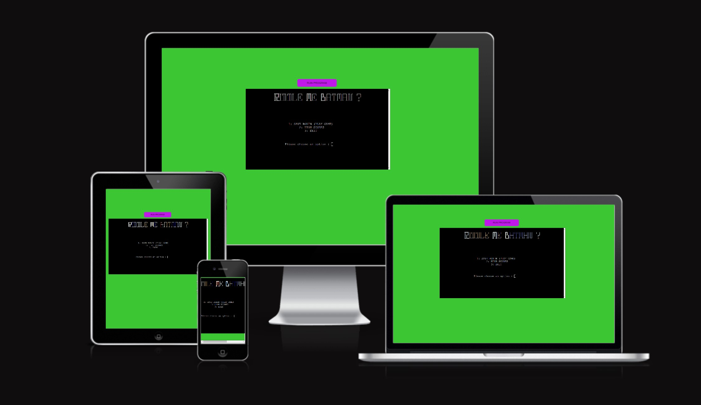

[View the live project here.](https://riddle-me-batman.herokuapp.com/)

# Goal for this Project
The goal of this project is to save Robin by guessing words set forth by The Riddler. These words will be associated with other superheroes/villains from the DC Universe. The player will get to choose letters from the whole english alphabet in order to spell out the hero/villain that he/she thinks The Riddler is referring to. (You) the user are Batman aka *your own username* and your job is to save Robin who is currently kidnapped. The player will have 6 chances at guessing out the word otherwise The Riddler will hang Robin.

# Table of Contents
* [UX](#ux "UX")
    * [User Goals](#user-goals "User Goals")
    * [User Stories](#user-stories "User Stories")
    * [Site Owners Goals](#site-owners-goals)
    * [User Requirements and Expectations](#user-requirements-and-expectations)
         * [Requirements](#requirements)
         * [Expectations](#expectations)
    * [How to Play](#how-to-play)
    * [Design Choices](#design-choices)
        * [Fonts](#fonts)
        * [Colours](#colours)
        * [Images](#images)
        * [Structure](#structure)
    * [Wireframes](#wireframes)
    * [Features](#features)
        * [Existing Features](#existing-features)
        * [Features to be implemented](#features-to-be-implemented)
    * [Technologies used](#technologies-used)
        * [Languages](#languages)
        * [Libraries and Frameworks](#libraries-and-frameworks)
        * [Tools](#tools)
    * [Testing](#testing)
        * [UX Testing](#ux-testing)
        * [Code Validation](#code-validation)
        * [Bugs](#bugs)
        * [Unfixed Bugs](#unfixed-bugs)
    * [Deployment](#deployment)
    * [Credits](#credits)

# UX

## User Goals
* Read rules
* Type in a user name
* View High Scores
* Exit the Game

## User Stories
* As a user, I want to be able create a user name 
* As a user, I want to read the rules
* As a user, I want to skip through game instructions if required
* As a user, I want to know the outcome of the game

## Site owners Goals
* Have a visual presentation of the game 
* Give the user feedback on performance
* Ensure that there is validation for expected answers on all user inputs
* Simplify user input directions

## User Requirements and Expectations

### Requirements
* Single page layout
* Feedback on performance
* Clear instruction as to when the game starts and finishes
* Validation of user inputs
* Feedback to the user on their input to the game

### Expectations
* I expect to know that it is my game based on a username
* I expect to know when the game starts and finishes
* I expect to have the option of reading the rules or not
* I expect not to be able to make any typing errors
* I expect feedback on performance

\
&nbsp;
[Back to Top](#table-of-contents)
\
&nbsp;

## How to Play

* Will play like the standard paper and pencil game of hangman
    * 1 Player Game
    * Words will be randomized
    * Lives will be deducted for incorrect guesses
* User will be given a riddle to solve the word
    * The player creates a username
    * Words care completely randomized
    * The user decides what letters they choose
* Player will be given 6 chances to figure out the word
* If player can't figure out the word they lose the game
* If player figures out the word the move on to the next word

\
&nbsp;
[Back to Top](#table-of-contents)
\
&nbsp;

## Design Choices
### Fonts

The terminal that was provided by Code Institute to complete this project, used a standard monospace font. Which is the font I decided to keep using.

### Colours

The colour scheme I have chosen is based on what The Riddler uses as his colors in the comics [Riddler Costume](https://www.gamelivestory.com/images/article/batman-8-times-riddler-acted-like-a-hero-in-the-comics-main.webp "Riddler Custome Colors"). Which was a bright [lime green](wireframes/images/color_contrast_green.png) and [electric purple](wireframes/images/color_contrast_purple.png). I used [Coolors](https://coolors.co/ "Coolors") to create the colors myself instead of generating them randomly since I already knew what I wanted. [contrast checker](https://webaim.org/resources/contrastchecker/ "contract checker") was used to contrast the colors as my background choice with a black foreground text. Only the electric purple didn't pass in one catergory. Regardless I won't have text over these colors since they will only be the background colors and not run in the termimal.

[Colour Scheme](wireframes/images/coolors_scheme.png)

### Images

No images were used for this game, however, to have the title stand out, I used [patorjk.com](http://patorjk.com/software/taag/#p=display&h=1&f=Big&t=Riddle%20Me%20Batman%0A) with the font set to *Calvin S* to create giant text that would appear as though it's an image on the home terminal.

\
&nbsp;

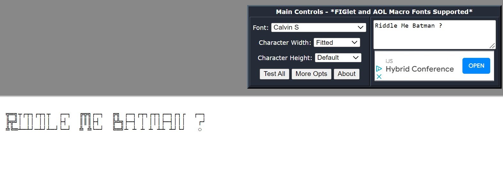


### Structure
The structure of this project has been mapped out using [App Diagrams](https://app.diagrams.net/ "app diagrams"), all the shapes were chosen by me to diagram the flow of the project.

\
&nbsp;
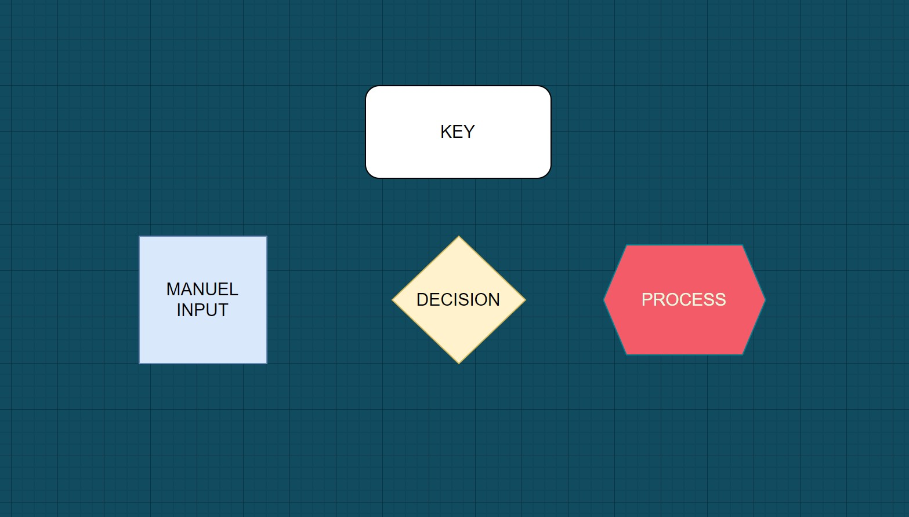
\
&nbsp;


I created 3 choice inputs for the start of the game.

1. Start Game
2. High Scores
3. Exit

From ther the logic can be followed with the flow chart structure below. 

\
&nbsp;
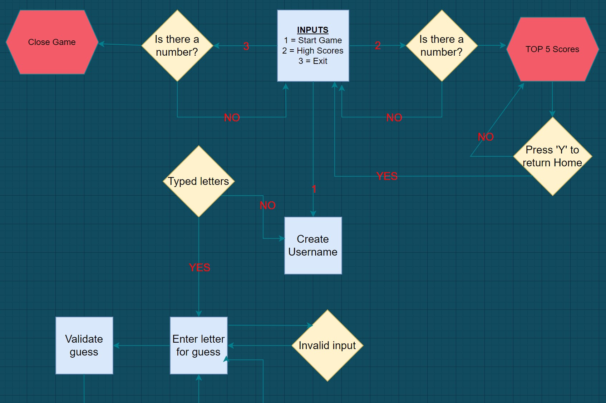
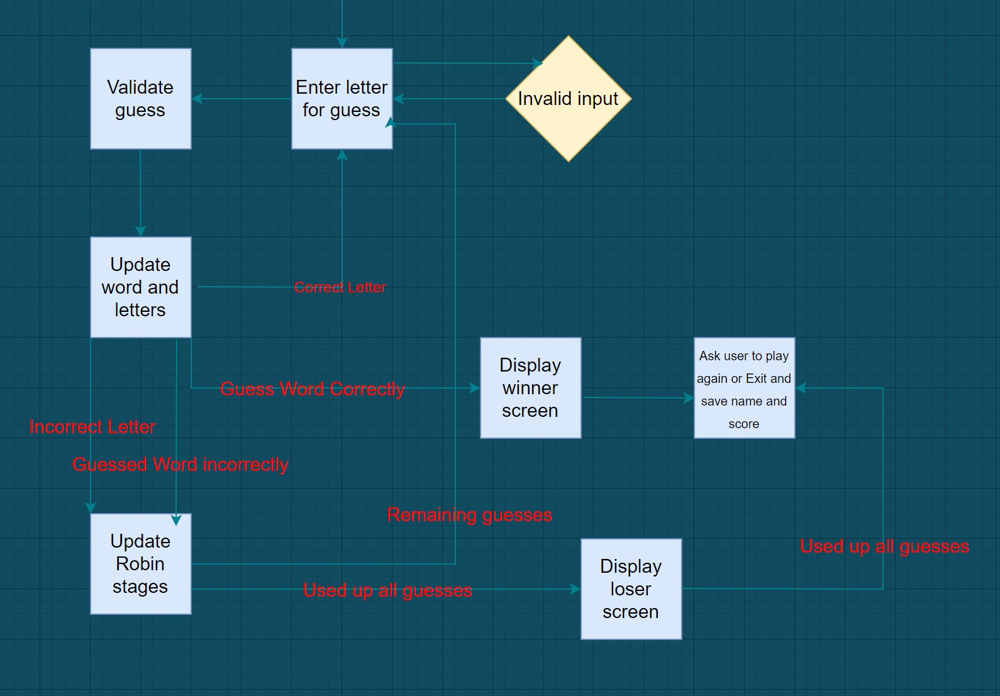
\
&nbsp;

\
&nbsp;
[Back to Top](#table-of-contents)
\
&nbsp;

# Wireframes

The game will be built using a pre-built template that Code Institute has provided. This template already scales down for different screen sizes. For this reason I kept my wireframes simple.

* [Mobile Wireframe](wireframes/wireframe-images/mobile.png "Mobile")

* [Tablet Wireframe](wireframes/wireframe-images/tablet.png "Tablet")

* [Desktop Wireframe](wireframes/wireframe-images/desktop.png "Desktop")

\
&nbsp;
[Back to Top](#table-of-contents)
\
&nbsp;

# Features

## Existing Features

Image of the home screen when the player runs the program. The user will be greeted with the 3 input options. With a text at the very bottom that will ask the user to 

**Please choose an option :**

    Typing 1 = Play Game
    Typing 2 = High Scores
    Typing 3 = Exit

*(Input 3 will close out the terminal like exiting any program)*

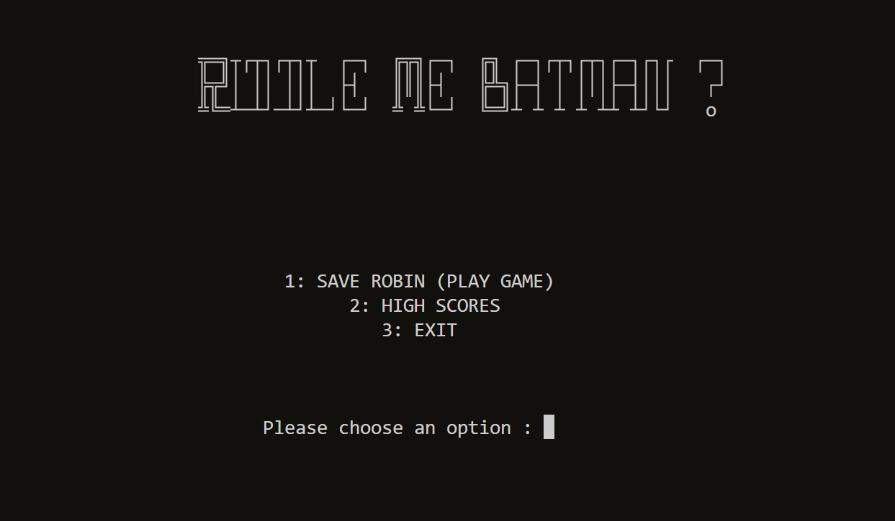

\
&nbsp;

* The next image is of the game itself which is that of the old school hangman game but with the twist that it's Robin you have to save from being hung. The user with have to guess letters 1 by 1 in order to solve the word. When the user makes a guess whether correct or wong a * asterisk will fill the place of the letters gussed so the user knows not to choose that letter again. However in this game that is still a possibility in which the user will get a string that let's them know they already guessed that letter and still waste an attempt.

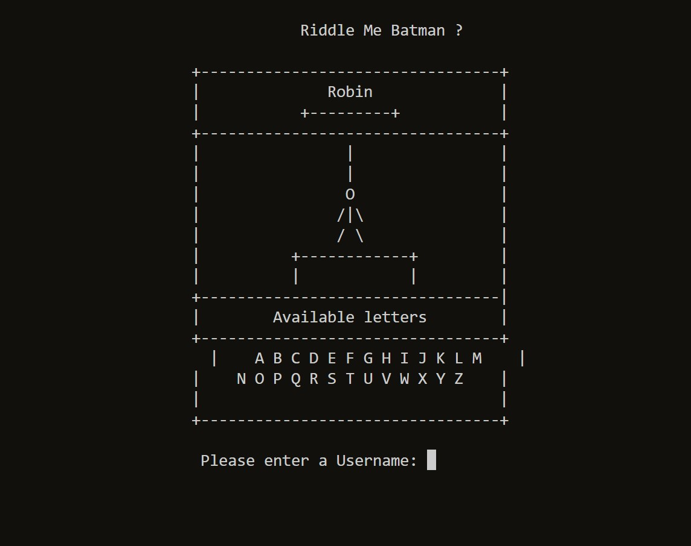

\
&nbsp;

* The score image list the top 5 players who were able to guess the most DC characters ever. If a user surpasses the score of of anyone of the top 5 players they will be added to the top 5 list and remove those that have the lowest score.

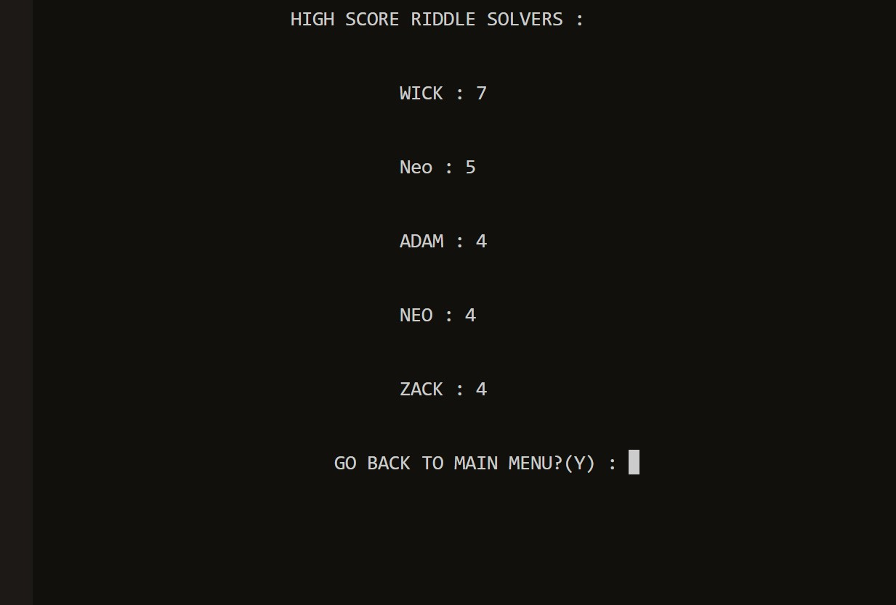

\
&nbsp;

* The username input field appears at the bottom underneath the game letters. From there the player will create a username that will allow them to play the game and have the chance to have their name recorded into the top 5 list if they are good enough.

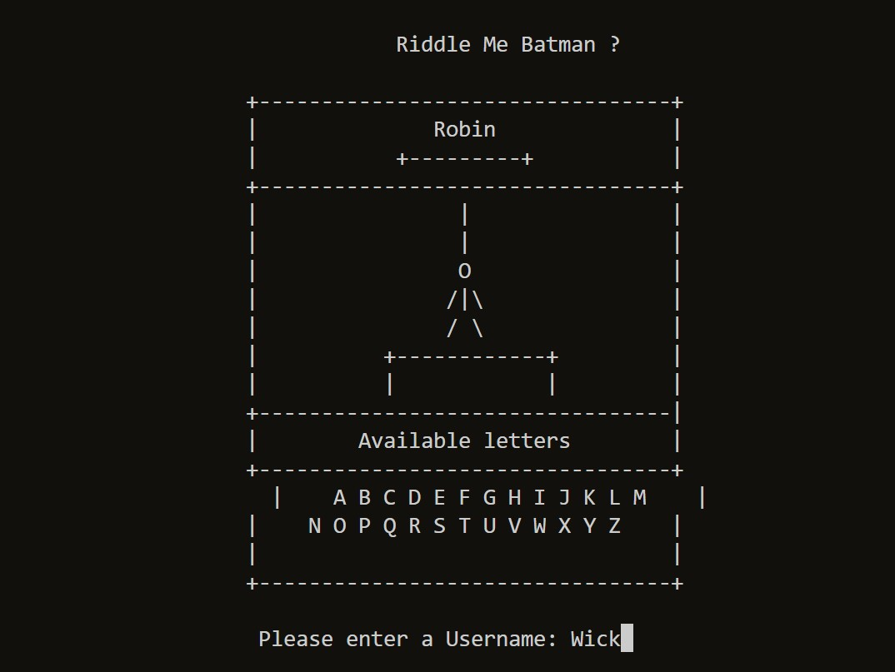

\
&nbsp;

* Guess the letters screen allows the player to guess what letters belong in the word.

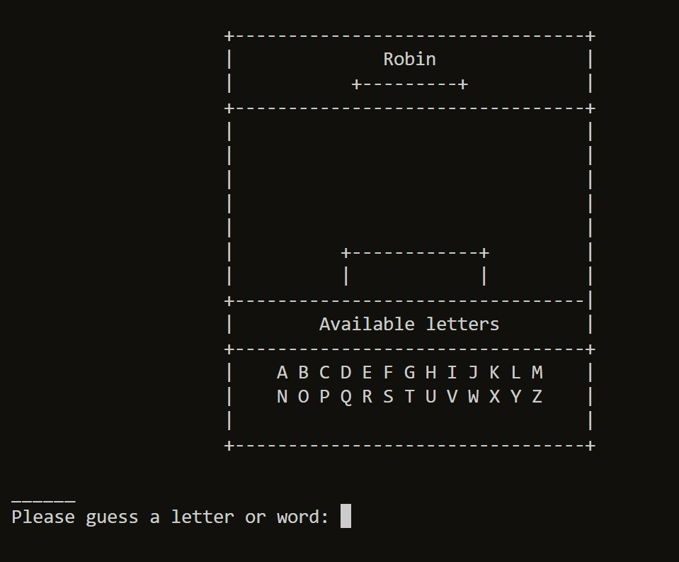

\
&nbsp;

* Guessing incorrectly results in the following image within the game.

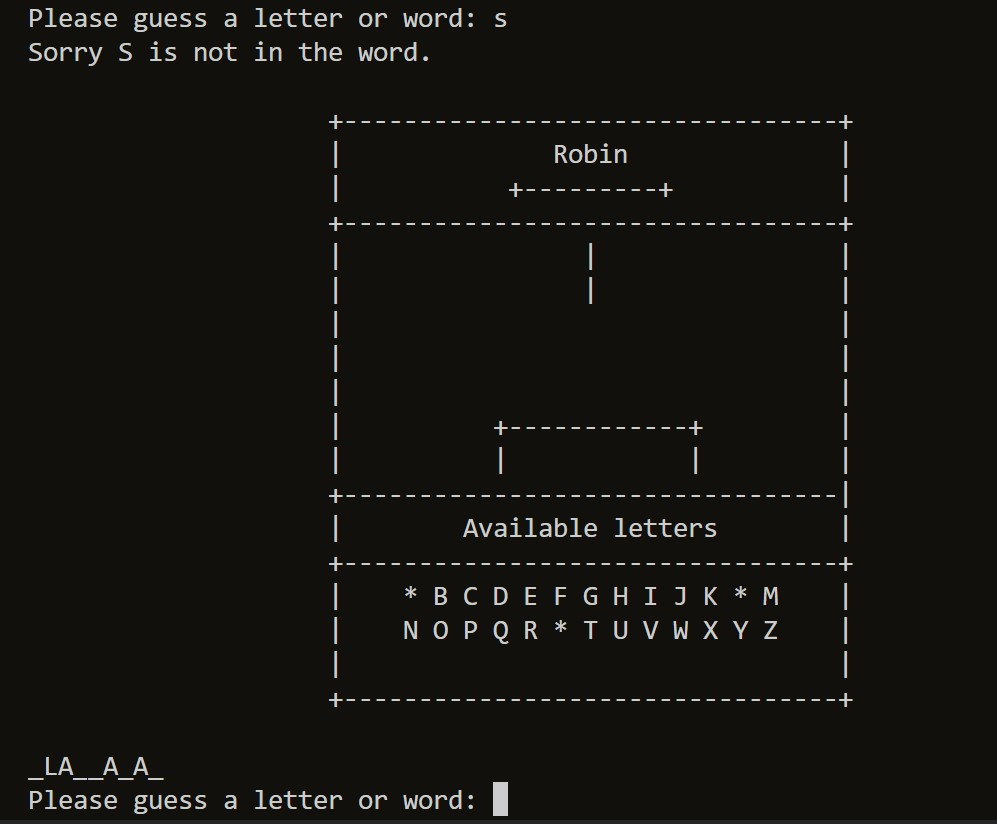

\
&nbsp;

* Guessing correctly results in the following image within the game.

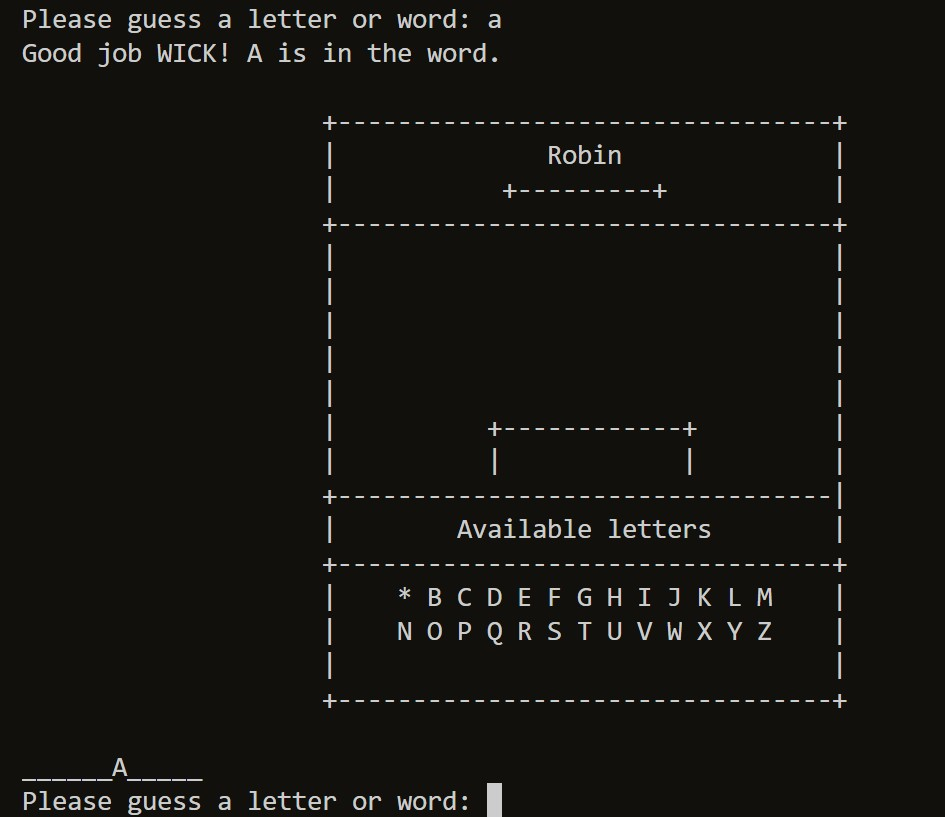

\
&nbsp;

* A repeated guess results in the following image.

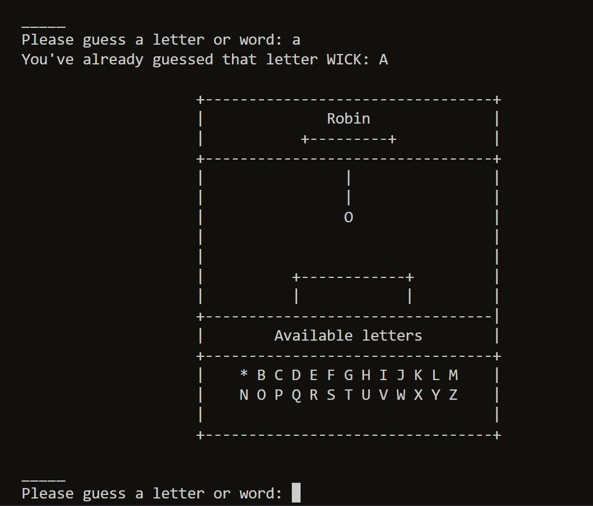

\
&nbsp;

* Winning the game results in the following image with the 2 options to play again or not by using the following inputs.
    * 'Y' for Yes
    * 'N' for No

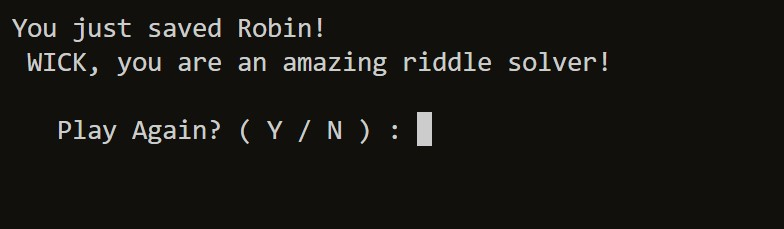

\
&nbsp;

* Losing the game results in the following image with the 2 options to play again or not by using the following inputs.
    * 'Y' for Yes
    * 'N' for No

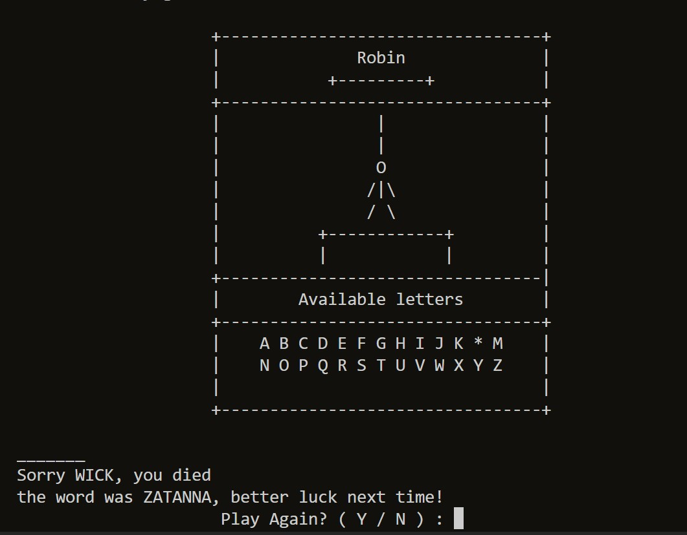

\
&nbsp;

* Google spreadsheets works with the data being sent to it by the game.
    * Username
    * Score

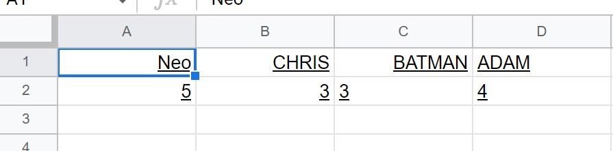

\
&nbsp;

## Features to be Implemented

1. Riddle array that attaches at the bottom of the game letters box
1. Sound effects for guessing the correct letter and wrong letter

\
&nbsp;
[Back to Top](#table-of-contents)
\
&nbsp;

# Technologies used

## Languages
* [HTML](https://en.wikipedia.org/wiki/HTML5 "HTML") for the structure of the site
* [CSS](https://en.wikipedia.org/wiki/CSS "CSS") for the design of the site
* [JavaScript](https://en.wikipedia.org/wiki/JavaScript "JS") was built into the template supplied by Code Institute
* [Python](https://en.wikipedia.org/wiki/Python_(programming_language) "Python") for the game code
* [StackEdit](https://stackedit.io/app#) for the content in my README file

\
&nbsp;

## Libraries and Frameworks

* Python package for Google Sheets [gspread](https://docs.gspread.org/en/v4.0.1/)
* For delying the appearance of the text [python time library](https://docs.gspread.org/en/v4.0.1/ ".py time")
* For selecting a random word from the word list [python random library](https://docs.python.org/3/library/random.html?#module-random ".py random")

\
&nbsp;

## Tools

* For construction [Gitpod](https://www.gitpod.io/ "Gitpod")
* For wireframes [Balsamic](https://balsamiq.com/wireframes/ "Balsamic")
* For CSS validation [W3C CSS Validation Service](https://jigsaw.w3.org/css-validator/ "W3C CSS")
* For python code validation [PEP8 online](http://pep8online.com/ "PEP8")
* For HTML validation [W3C HTML Validation Service](https://validator.w3.org/ "W3C HTML")
* For the contract checking [WebAIM](https://webaim.org/resources/contrastchecker/ "WebAIM")
* For general code queries [W3Schools](https://www.w3schools.com/ "W3Schools")
* For python queries [python](https://www.python.org/ "py")
* For the colour pallet [Coolors](https://coolors.co/ "coolors")
* For the API [Google Cloud Platform](https://en.wikipedia.org/wiki/Google_Cloud_Platform "GCP") 
* To hold the completed game data [Google Sheets](https://en.wikipedia.org/wiki/Google_Sheets "Sheets")

# Testing

I tested using friends and families and asked them for their input.

I informed everyone that it's based on a hangman game but with the twist that it's centered around 'The Riddler' a villain of Batman and you have to save Robin by guessing the words which are based on the DC Universe characters from the comics.

I asked them to cover all bases, from losing to winning and trying all inputs within the game.

&nbsp;

| Age | Tech Experience | Task Completed | Comments/ Improvements
| --- | ----------      | -------------  | --------
|  31 | Limited         | No             | Can you add color?
| 32  | Limited         | Yes            | Can you give hints to the word?
| 39  | Moderate        | Yes            | Make it so I don't have to capitalize my letters
| 26  | Advanced        | Yes            | Can you have a counter of attempts on the side?
| 55  | Moderate        | No             | I like the design but don't know about heroes
| 8   | None            | Yes            | This is a old game and boring
| 41  | Limited         | Yes            | Not bad, add more characters

&nbsp;

From this testing, I implemented the changes that were recommended as they were all within my capabilities and not time-consuming to achieve.

### UX Testing

| Requirements & Expectations | Implemented | Tested | Comments
| ------------ | ----------- | ------ | --------
|Single page layout | Yes | Yes | Provided by Code Institute template
|Feedback on performance | Yes | Yes | Many suggestions that I won't be able to complete
| Clear instruction as to when the game starts and finishes | Yes | Yes | Create username and have a scoring system
|Validation of user inputs| Yes | Yes | Validate all user inputs with no errors
| Feedback to the user on their input to the game | Yes | Yes | Allow the user to know if they pressed the incorrect key or correct key with string information
| Option of reading the rules or not | Yes | No | Was not able to complete on time but would of loved to, still think it's simplified enough to learn as you go with the input information

&nbsp;

&nbsp;

| User Goals | Implemented | Tested | Comments
| ------------ | ----------- | ------ | --------
| Create username | Yes | Yes | letters only
| High score system | Yes | Yes | Works with every user created but only top 5 scores get added to data sheet
| Close out the game | Yes | Yes | The terminal closes and nothing works, no way to reboot it, only freshing the page will work
| Clear instruction as to how to play the game | No | No | No time but instructions are simplified
| Know the outcome of the game, win, lose | Yes | Yes | Displayed at the end of the game

&nbsp;

&nbsp;

| Site Owners Goals | Implemented | Tested | Comments
| ------------ | ----------- | ------ | --------
| Create clear spacing between sentences | Yes | Yes | Line spacing and delay printing of text
| Give the user feedback on performance | Yes | Yes | Will display at the end of the game
| Ensure that there is validation for expected answers on all user inputs | Yes | Yes | Validation created for all user entries

\
&nbsp;
[Back to Top](#table-of-contents)
\
&nbsp;

## Code Validation

Using the [PEP8](http://pep8online.com/ "PEP8") code validator for the Python code, I was able to eliminate all errors and have listed the images for the corresponding file names.

&nbsp;

* [Data Validation](wireframes/testing/data-validation.jpg)

* [Functions Validation](wireframes/testing/functions-validation.jpg)

* [Utils Validation](wireframes/testing/utils-validation.jpg)

* [Words Validation](wireframes/testing/words-validation.jpg)

\
&nbsp; 


## Bugs

I had a few bugs in the creation of the project. 

* I had a major issue sending the data over to google sheets and would receive a index error. So instead of having the username and score on the same column I opted to have both on back to back columns as you can see on this [image](wireframes/images/data-image.jpg) and just have the data progress that way.

    * This is on my list of things I would of wish I would of had time to fix

* Another issue I encountered was that I didn't set up the while loop correctly for the attempt lives which gave the player infinite lives on taking guesses. This was fixed after about a day and a half when I reliazed it.

## Unfixed Bugs

* On mobile screens the game is chopped up and I was unable to fix this issue on time. You can see most of the terminal but the left and right end disappear on the screen.

\
&nbsp;
[Back to Top](#table-of-contents)
\
&nbsp;

# Deployment

The site was deployed via Heroku. Here is the live link - [Riddle Me Batman](https://riddle-me-batman.herokuapp.com/ "link")

The project repository was created using the *Code-Institute-Org/python-essentials-template* on GitHub and edited using GitPod.

### Create a Google Sheets document
* Log in to your Google account. If you do not have one, create a personal one [here](https://accounts.google.com/signup/v2/webcreateaccount?flowName=GlifWebSignIn&flowEntry=SignUp "Create Google Account")
* In the Google Apps, waffle in the top right corner of the screen select **Sheets**
* In the *Start a new spreadsheet* section, select **Blank**
* These next naming stages are critical, please ensure they are correct
* Give your new Google Sheets workbook a name of *riddle_me_batman* in the top left corner
* Give your worksheet a name of *highscores* in the bottom left corner
* Create your column headings

| Cell Reference | Content 
| ------| -----
| A1 | Username
| B1 | Scores

### Activate API Credentials
* Open the *Google Cloud Platform* by following this [link](https://console.cloud.google.com/?pli=1 "Google Cloud Platform")
* Ensure the correct account is selected in the top right corner of the screen
* Click on the **Select a project** button in the main navbar
* Then select **New Project**
* Give the project a name and click **Create**
* In the information box, select **Select Project**
* Open the hamburger in the top left corner and select **APIs and Services** and the **Library**
* In the Search bar type *Google Drive* and then select **Google Drive API**
* Click **Enable**
* Click **Create Credentials** button in the top right corner of the screen
* From the dropdown, select *Google Drive API*
* Select *Application data* and then *No, I'm not using them* and click on **Next**
* Enter a *Service account name*, this can be anything you like and click on **Create and Continue**
* From the *Select a role* dropdown, hover over *Basic* and select **Editor** the click on **Done**
* On the next screen, click on the long email address in the *Service Accounts* section
* In the navigation tabs below your service account name, select *KEYS*
* Click on the *ADD KEY* dropdown and select **Create new key**
* Ensure *JSON* is selected and then click on **Create**
* This downloads the credentials file, usually this will be downloaded to your downloads folder, but check its location by right-clicking on it at the bottom of the screen and select **Show in folder**
* Open the hamburger in the top left corner and select **APIs and Services** and the **Library**
* In the Search bar type *Google Sheets* and then select **Google Sheets API**
* Click **Enable**

 
### Clone the repo with GitPod
* Log in to your GitHub account
* Follow this link to access this repository - [52 card golf repo](https://github.com/CHAMPION316/Riddle-Me-Batman)
* Select the **Code** dropdown button situated above the list of files
* Make sure that the HTTPS tab is selected
* Click on the **Copy** button to the right of the URL
* Open a new GitPod workspace
* In the terminal type the following code and then press enter
```
git clone https://github.com/CHAMPION316/Riddle-Me-Batman
```
* The repo will now be downloaded and cloned
* Open your [GitPod workspaces](https://gitpod.io/workspaces "GitPod workspaces")
* Select the three dots to the right-hand side of your workspace and select **Pin**

### Set up your Workspace

* Locate your credentials file that you downloaded in the [Activate API Credentials](#activate-api-credentials) section.
* Drag and drop it into your workspace, below the files.
* Right-click on the file and rename it to *creds.json*
* Open the creds.json file and copy the content of the client email

 ```
 "client_mail": "____copy_this_____"
 ```

* Open your Google Sheets worksheet previously created.
* Click the **Share** button in the top right corner
* Paste in the *client email*
* Ensure *Editor* is selected in the dropdown
* Unselect the *Notify people* checkbox
* Click the **Share** button
* Go back to your workspace
* Open the file *gitignore*
* Add *creds.json* to the bottom of the list and save the file *(Ctrl + S)*
* In the terminal in your workspace, type the following and then press enter:
```
git add .

```
* In the terminal then, type the following and then press enter:
```
git status

```
* If your creds.json file appears in the terminal, please revisit from the *'Go back to your workspace'* point as a mistake has been made.
* To install your dependencies into the workspace, enter the below code into the terminal and then hit enter

```
pip3 install gspread google-auth
```


### Deployment via Heroku

* Visit [heroku.com](https://www.heroku.com/home "Heroku")
* Create a new account or sign in
* From the dashboard, select **New** and then **Create new app**
* Enter an individual app name into the text box, select a region from the dropdown and then press **Create app**
* A Heroku app has now been created and the **Deploy** tab is opened. 
* Select the **Settings** tab
* Click on the **Reveal Config Vars** button
* In the textbox with KEY as the placeholder, enter *CREDS*
* In the textbox with VALUE as the placeholder, enter the content from the creds.json file and press **Add**
* In the textbox with KEY as the placeholder, enter *PORT*
* In the textbox with VALUE as the placeholder, enter *8000*
* press **Add**
* In the buildpacks section of the settings tab, click on **Add Buildpack**, select **python** and then save changes
* Click on **Add Buildpack** again, select **node.js** and then save changes
* When they are on the dashboard, ensure that python is above node.js on the list
* Open the **Deploy** tab
* In the deployment method section, select **GitHub** and confirm the connection.
* Enter the repo-name into the text box and click **Search**. When the correct repo appears below, click **Connect**
* In the Automatic deploys section, click **Enable Automatic Deploys**. This updates every time GitHub code is pushed
* To complete the process click on the **Deploy Brach** button in the Manual deploy section, this will take a few seconds to complete while Heroku builds the app
* A message will appear informing you that the app was successfully deployed and a **View** button will bring you to the live site