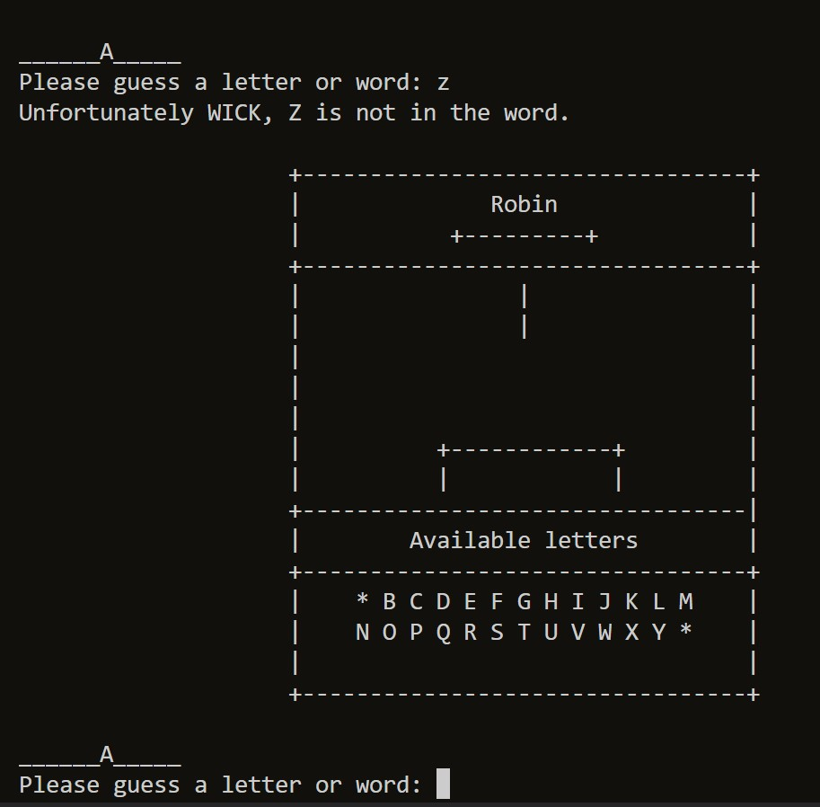

# Riddle Me Batman

[View the live project here.](https://riddle-me-batman.herokuapp.com/)

# Goal for this Project
The goal of this project is to solve the riddles set forth by The Riddler. These riddles will be associated with other superheroes/villains from the DC Universe. The player will get to choose letters from the whole english alphabet in order to spell out the hero/villain that he/she thinks The Riddler is referring to. (You) the user are Batman and your job is to save Robin who is currently kidnapped. The player will have 6 chances at spelling out these names otherwise The Riddler will hang Robin.

# Table of Contents
* [UX](#ux "UX")
    * [User Goals](#user-goals "User Goals")
    * [User Stories](#user-stories "User Stories")
    * [Site Owners Goals](#site-owners-goals)
    * [User Requirements and Expectations](#user-requirements-and-expectations)
         * [Requirements](#requirements)
         * [Expectations](#expectations)
    * [How to Play](#how-to-play)
    * [Design Choices](#design-choices)
        * [Fonts](#fonts)
        * [Colours](#colours)
        * [Images](#images)
        * [Structure](#structure)
    * [Wireframes](#wireframes)
    * [Features](#features)
        * [Existing Features](#existing-features)
        * [Features to be implemented](#features-to-be-implemented)
    * [Technologies used](#technologies-used)
        * [Languages](#languages)
        * [Libraries and Frameworks](#libraries-and-frameworks)
        * [Tools](#tools)
    * [Testing](#testing)
        * [UX Testing](#ux-testing)
        * [Code Validation](#code-validation)
        * [Bugs](#bugs)
        * [Unfixed Bugs](#unfixed-bugs)
    * [Deployment](#deployment)
    * [Credits](#credits)

# UX

## User Goals
* Read rules
* Type in a user name
* View High Scores
* Exit the Game

## User Stories
* As a user, I want to be able create a user name 
* As a user, I want to read the rules
* As a user, I want to skip through game instructions if required
* As a user, I want to know the outcome of the game

## Site owners Goals
* Have a visual presentation of the game 
* Give the user feedback on performance
* Ensure that there is validation for expected answers on all user inputs
* Simplify user input directions

## User Requirements and Expectations

### Requirements
* Single page layout
* Feedback on performance
* Clear instruction as to when the game starts and finishes
* Validation of user inputs
* Feedback to the user on their input to the game

### Expectations
* I expect to know that it is my game based on a username
* I expect to know when the game starts and finishes
* I expect to have the option of reading the rules or not
* I expect not to be able to make any typing errors
* I expect feedback on performance

\
&nbsp;
[Back to Top](#table-of-contents)
\
&nbsp;

## How to Play

* Will play like the standard paper and pencil game of hangman
    * 1 Player Game
    * Words will be randomized
    * Lives will be deducted for incorrect guesses
* User will be given a riddle to solve the word
    * The player creates a username
    * Words care completely randomized
    * The user decides what letters they choose
* Player will be given 6 chances to figure out the word
* If player can't figure out the word they lose the game
* If player figures out the word the move on to the next word

\
&nbsp;
[Back to Top](#table-of-contents)
\
&nbsp;

## Design Choices
### Fonts

The terminal that was provided by Code Institute to complete this project, used a standard monospace font. Which is the font I decided to keep using.

### Colours

The colour scheme I have chosen is based on what The Riddler uses as his colors in the comics [Riddler Costume](https://www.gamelivestory.com/images/article/batman-8-times-riddler-acted-like-a-hero-in-the-comics-main.webp "Riddler Custome Colors"). Which was a bright [lime green](wireframes/images/color_contrast_green.png) and [electric purple](wireframes/images/color_contrast_purple.png). I used [Coolors](https://coolors.co/ "Coolors") to create the colors myself instead of generating them randomly since I already knew what I wanted. [contrast checker](https://webaim.org/resources/contrastchecker/ "contract checker") was used to contrast the colors as my background choice with a black foreground text. Only the electric purple didn't pass in one catergory. Regardless I won't have text over these colors since they will only be the background colors and not run in the termimal.

[Colour Scheme](wireframes/images/coolors_scheme.png)

### Images

No images were used for this game, however, to have the title stand out, I used [patorjk.com](http://patorjk.com/software/taag/#p=display&h=1&f=Big&t=Riddle%20Me%20Batman%0A) with the font set to *Calvin S* to create giant text that would appear as though it's an image on the home terminal.

\
&nbsp;

### Structure
The structure of this project has been mapped out using [App Diagrams](https://app.diagrams.net/ "app diagrams"), all the shapes were chosen by me to diagram the flow of the project.

\
&nbsp;

\
&nbsp;

I created 3 choice inputs for the start of the game.

1. Start Game
2. High Scores
3. Exit

From ther the logic can be followed with the flow chart structure below. 

\
&nbsp;

\
&nbsp;

\
&nbsp;
[Back to Top](#table-of-contents)
\
&nbsp;

# Wireframes

The game will be built using a pre-built template that Code Institute has provided. This template already scales down for different screen sizes. For this reason I kept my wireframes simple.

* [Mobile Wireframe](wireframes/wireframe-images/mobile.png "Mobile")

* [Tablet Wireframe](wireframes/wireframe-images/tablet.png "Tablet")

* [Desktop Wireframe](wireframes/wireframe-images/desktop.png "Desktop")

\
&nbsp;
[Back to Top](#table-of-contents)
\
&nbsp;

# Features

## Existing Features

Image of the home screen when the player runs the program. The user will be greeted with the 3 input options. With a text at the very bottom that will ask the user to 

**Please choose an option :**

    Typing 1 = Play Game
    Typing 2 = High Scores
    Typing 3 = Exit

*(Input 3 will close out the terminal like exiting any program)*

\
&nbsp;

* The next image is of the game itself which is that of the old school hangman game but with the twist that it's Robin you have to save from being hung. The user with have to guess letters 1 by 1 in order to solve the word. When the user makes a guess whether correct or wong a * asterisk will fill the place of the letters gussed so the user knows not to choose that letter again. However in this game that is still a possibility in which the user will get a string that let's them know they already guessed that letter and still waste an attempt.

\
&nbsp;

* The score image list the top 5 players who were able to guess the most DC characters ever. If a user surpasses the score of of anyone of the top 5 players they will be added to the top 5 list and remove those that have the lowest score.

\
&nbsp;

* The username input field appears at the bottom underneath the game letters. From there the player will create a username that will allow them to play the game and have the chance to have their name recorded into the top 5 list if they are good enough.

\
&nbsp;

* Guess the letters screen allows the player to guess what letters belong in the word.

\
&nbsp;

* Guessing incorrectly results in the following image within the game.

\
&nbsp;

* Guessing correctly results in the following image within the game.

\
&nbsp;

* A repeated guess results in the following image.

\
&nbsp;

* Winning the game results in the following image with the 2 options to play again or not by using the following inputs.
    * 'Y' for Yes
    * 'N' for No

\
&nbsp;

* Losing the game results in the following image with the 2 options to play again or not by using the following inputs.
    * 'Y' for Yes
    * 'N' for No

\
&nbsp;

* Google spreadsheets works with the data being sent to it by the game.
    * Username
    * Score

\
&nbsp;

## Features to be Implemented

1. Riddle array that attaches at the bottom of the game letters box
1. Sound effects for guessing the correct letter and wrong letter

\
&nbsp;
[Back to Top](#table-of-contents)
\
&nbsp;

# Technologies used

## Languages
* [HTML](https://en.wikipedia.org/wiki/HTML5 "HTML") for the structure of the site
* [CSS](https://en.wikipedia.org/wiki/CSS "CSS") for the design of the site
* [JavaScript](https://en.wikipedia.org/wiki/JavaScript "JS") was built into the template supplied by Code Institute
* [Python](https://en.wikipedia.org/wiki/Python_(programming_language) "Python") for the game code
* [StackEdit](https://stackedit.io/app#) for the content in my README file

\
&nbsp;

## Libraries and Frameworks

* Python package for Google Sheets [gspread](https://docs.gspread.org/en/v4.0.1/)
* For delying the appearance of the text [python time library](https://docs.gspread.org/en/v4.0.1/ ".py time")
* For selecting a random word from the word list [python random library](https://docs.python.org/3/library/random.html?#module-random ".py random")

\
&nbsp;

## Tools

* For construction [Gitpod](https://www.gitpod.io/ "Gitpod")
* For wireframes [Balsamic](https://balsamiq.com/wireframes/ "Balsamic")
* For CSS validation [W3C CSS Validation Service](https://jigsaw.w3.org/css-validator/ "W3C CSS")
* For python code validation [PEP8 online](http://pep8online.com/ "PEP8")
* For HTML validation [W3C HTML Validation Service](https://validator.w3.org/ "W3C HTML")
* For the contract checking [WebAIM](https://webaim.org/resources/contrastchecker/ "WebAIM")
* For general code queries [W3Schools](https://www.w3schools.com/ "W3Schools")
* For python queries [python](https://www.python.org/ "py")
* For the colour pallet [Coolors](https://coolors.co/ "coolors")
* For the API [Google Cloud Platform](https://en.wikipedia.org/wiki/Google_Cloud_Platform "GCP") 
* To hold the completed game data [Google Sheets](https://en.wikipedia.org/wiki/Google_Sheets "Sheets")

# Testing

I tested using friends and families and asked them for their input.

I informed everyone that it's based on a hangman game but with the twist that it's centered around 'The Riddler' a villain of Batman and you have to save Robin by guessing the words which are based on the DC Universe characters from the comics.

I asked them to cover all bases, from losing to winning and trying all inputs within the game.

&nbsp;